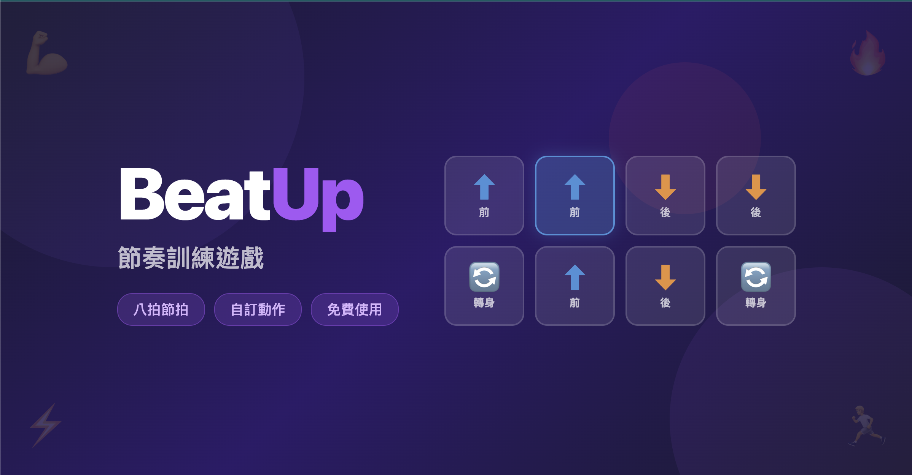

# BeatUp - 節奏訓練遊戲



BeatUp 是一款免費的網頁版節奏訓練工具，透過八拍節拍搭配動作指令，幫助使用者練習節奏感與肢體協調。適用於體適能、舞蹈教學、韻律課程等情境。

## 功能特色

- **八拍節拍系統** — 2×4 格子配置，每個格子對應一拍動作
- **自訂動作** — 除了內建的「前、後、轉身」，可自行新增 Emoji 動作
- **多關卡管理** — 自由新增、刪除、編排多個關卡
- **可調式 BPM** — 支援 60～300 BPM，適應不同節奏難度
- **看與做模式** — 每關播放兩次，第一次「看」、第二次「做」
- **拖拉編輯** — 直覺式拖放操作，輕鬆配置動作順序
- **隨機填入** — 一鍵隨機產生關卡配置
- **即時音效** — Web Audio API 合成電子鼓節拍，無需載入外部音檔
- **離線可用** — 資料儲存於 localStorage，純前端運作

## 使用方式

1. 開啟 `index.html`
2. 點擊「設定」進入編輯器，配置關卡的八拍動作與 BPM
3. 儲存後回到首頁，點擊「開始」進入遊戲模式
4. 跟著節拍，先「看」一次動作順序，再「做」一次

## 專案結構

```
BeatUp/
├── index.html          # 主頁面（首頁、編輯器、遊戲三個畫面）
├── css/
│   └── style.css       # 樣式
├── js/
│   ├── data.js         # 動作定義、關卡資料、localStorage 存取
│   ├── audio.js        # Web Audio API 音效合成
│   ├── editor.js       # 編輯器邏輯（拖拉、關卡管理）
│   ├── game.js         # 遊戲引擎（節拍排程、亮燈、關卡切換）
│   └── app.js          # 主程式（畫面切換、事件綁定）
└── image/
    ├── favicon.png     # 網站圖示
    └── preview.png     # 社群分享預覽圖
```

## 技術細節

- 純前端實作，無需後端伺服器
- 使用原生 JavaScript（無框架相依）
- 節拍引擎採用 Web Audio API 的 scheduler 模式，確保精準計時
- 音效透過 Oscillator + Noise Buffer 即時合成，模擬電子鼓音色

## 授權

All rights reserved.
